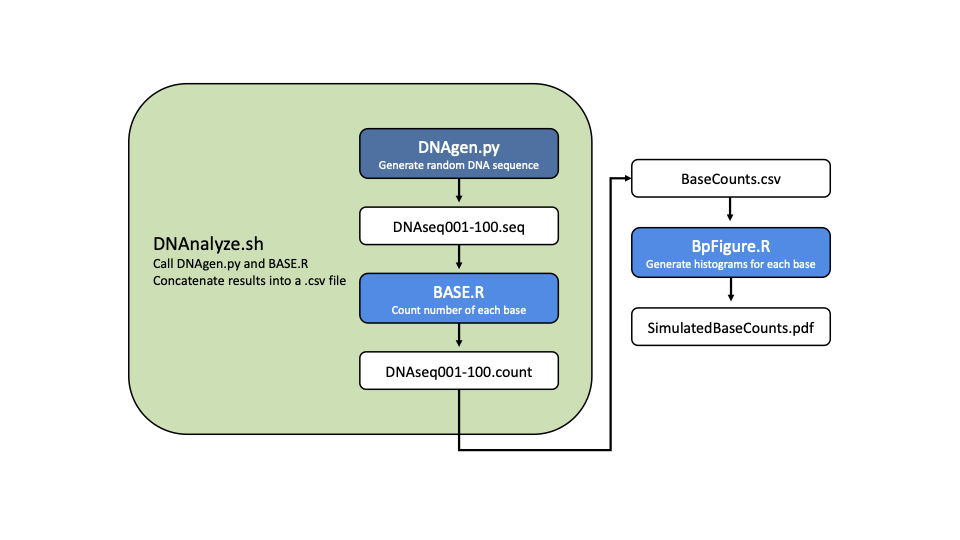

# BIOL 812 Individual Assignment
### Option #2

### By: Gihyun Yoo
### Github: gyoo1   

Assignment prepared for BIOL 812 Introduction to Computational Analysis Winter 2022. Created a pipeline to generate random DNA sequences, count the number of bases, and generate histograms of the simulated counts for each base.

# Scripts
1. `DNAgen.py` - simulates random DNA sequences of a given length
  + Parameters: `FileName` = output text file name, `Nb` = length of simulated sequences (base pairs)
2. `BASE.R` - counts number of bases for given DNA sequences
  + Parameters: `FileName` = input & output text file name
3. `DNAnalyze.sh` - calls DNAgen.py and BASE.R; creates a .csv file with the output from BASE.R
4. `BpFigure.R` - generates histograms for the DNA base counts

# Pipeline

1. `DNAnalyze.sh` calls `DNAgen.py` and generates 100 sequences of length 1000bp. File names follow this format: `DNAseq001.seq` ... `DNAseq1000.seq`
2. `DNAnalyze.sh` calls `BASE.R` and uses output from Step 1 to generate counts for each base type. Results are output as `DNAseq001.count` ... `DNAseq100.count`
3. `DNAnalyze.sh` combines all results from Step 2 into a single .csv file: `BaseCounts.csv`
4. `BpFigure.R` uses `BaseCounts.csv` to generate histograms for each base counts (A, G, C, T). The plot is saved as `SimulatedBaseCounts.pdf`
